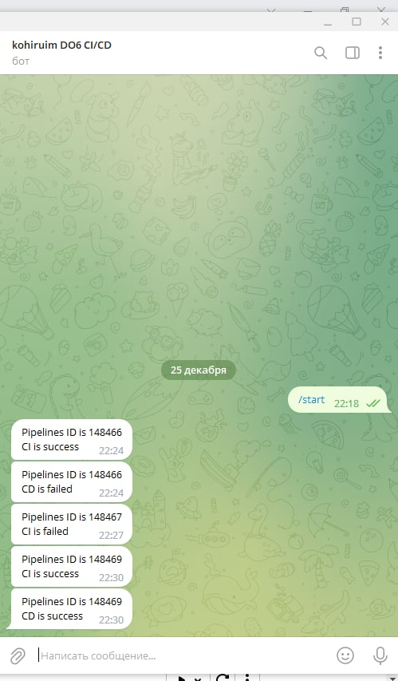

# Basic CI/CD

Разработка простого **CI/CD** для проекта *SimpleBashUtils*. Сборка, тестирование, развертывание.

## Contents

1. [Настройка gitlab-runner](#part-1-настройка-gitlab-runner)  
2. [Сборка](#part-2-сборка)  
3. [Тест кодстайла](#part-3-тест-кодстайла)   
4. [Интеграционные тесты](#part-4-интеграционные-тесты)  
5. [Этап деплоя](#part-5-этап-деплоя)  
6. [Дополнительно. Уведомления](#part-6-дополнительно-уведомления)

### Part 1. Настройка **gitlab-runner**

##### Поднять виртуальную машину. Скачать и установить на виртуальную машину **gitlab-runner**

1. curl -L "https://packages.gitlab.com/install/repositories/runner/gitlab-runner/script.deb.sh" | sudo bash
2. apt-get install gitlab-runner

##### Запустить **gitlab-runner** и зарегистрировать его для использования в текущем проекте (_DO6_CICD_)

### Part 2. Сборка

#### Написать этап для **CI** по сборке приложений из проекта _C2_SimpleBashScripts_. В файле _gitlab-ci.yml_ добавить этап запуска сборки через мейк файл из проекта _C2_. Файлы, полученные после сборки (артефакты), сохранять в произвольную директорию со сроком хранения 30 дней.

### Part 3. Тест кодстайла

#### Написать этап для **CI**, который запускает скрипт кодстайла (_clang-format_).

#### Если кодстайл не прошел, то "зафейлить" пайплайн. В пайплайне отобразить вывод утилиты _clang-format_.

### Part 4. Интеграционные тесты

#### Написать этап для **CI**, который запускает ваши интеграционные тесты из того же проекта:

##### Запускать этот этап автоматически только при условии, если сборка и тест кодстайла прошли успешно

##### Если тесты не прошли, то "зафейлить" пайплайн

##### В пайплайне отобразить вывод, что интеграционные тесты успешно прошли / провалились

1. Сборка и тест кодстайла прошли
   
   

2. Сборка и тест кодстайла прошли, тесты - нет
   
   

3. Тест кодстайла - фейл, тесты не делаются
   

### Part 5. Этап деплоя
#### Написать этап для **CD**, который "разворачивает" проект на другой виртуальной машине:

##### Запускать этот этап вручную при условии, что все предыдущие этапы прошли успешно

##### Написать bash-скрипт, который при помощи **ssh** и **scp** копирует файлы, полученные после сборки (артефакты), в директорию _/usr/local/bin_ второй виртуальной машины

1. Настроить netplan     
   
2. Скопировать ключ на ws11       
   
3. Cкрипт - scp C3_SimpleBashUtils-1/src/cat/s21_cat C3_SimpleBashUtils-1/src/grep/s21_grep ws11@172.24.116.8:/usr/local/bin
   
   
   

##### В случае ошибки "зафейлить" пайплайн

### Part 6. Дополнительно. Уведомления

##### Настроить уведомления о успешном/неуспешном выполнении пайплайна через бота с именем "[ваш nickname] DO6 CI/CD" в *Telegram*
- Текст уведомления должен содержать информацию об успешности прохождения как этапа **CI**, так и этапа **CD**.
- В остальном текст уведомления может быть произвольным.
1. #148466 СD - fail
2. #148467 CI - fail (style - fail)
3. #148469 - success

